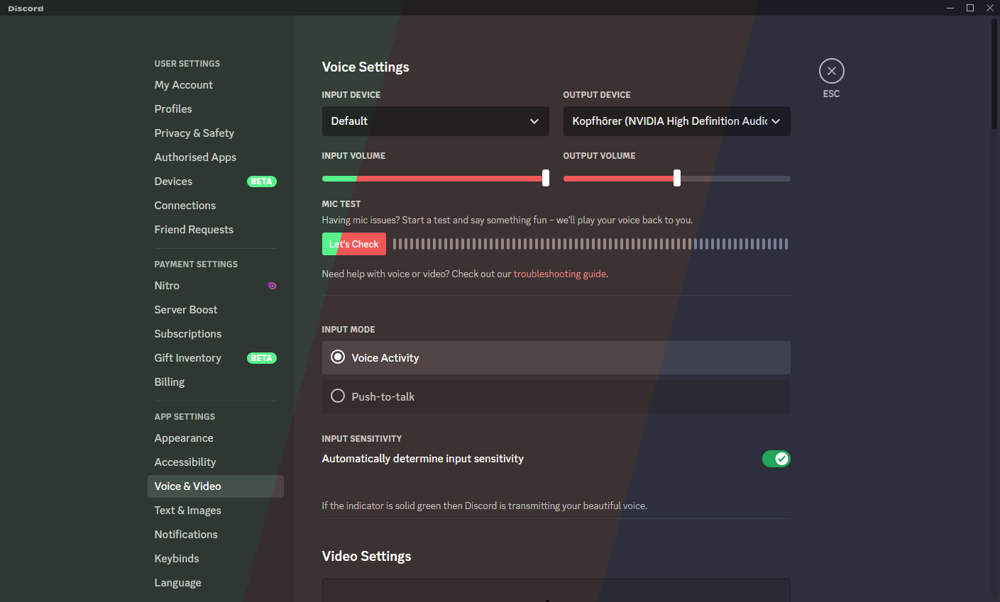
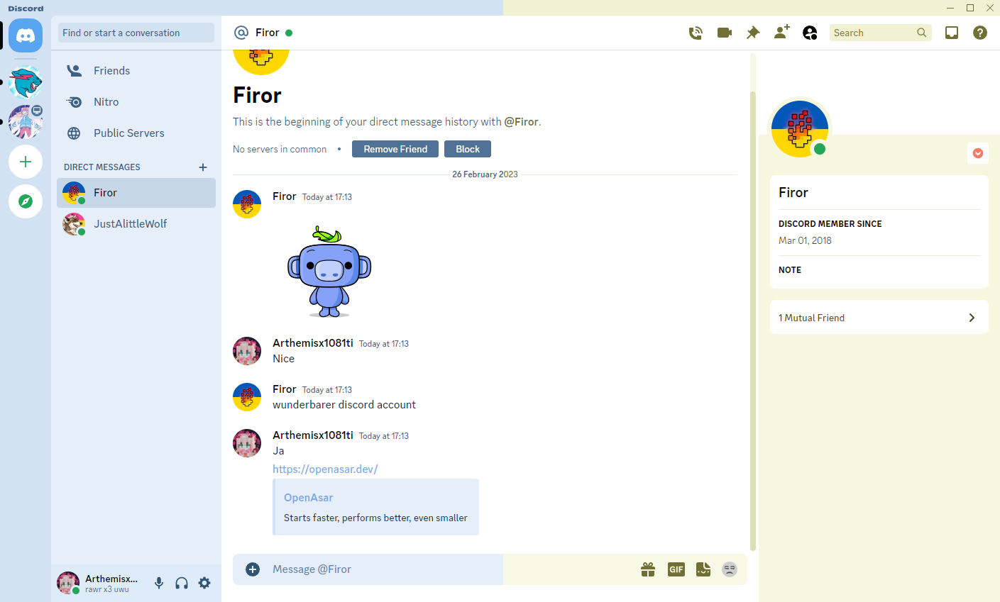

<h1>Material You Discord Colors</h1>

Change Discord's colors to match your favourite color theme

### Installation

#### Openasar

Copy and paste the contents of [MaterialYouColors.theme.css](https://github.com/JustAlittleWolf/Material-You-Discord-Theme/blob/main/MaterialYouColors.theme.css) into Theming

#### Better Discord

Download the latest [Release](https://github.com/JustAlittleWolf/Material-You-Discord-Theme/releases/download/1.0.0/MaterialYouColors.theme.css) and drop it into your Themes folder

### Preview

Change Discord to any color you want

Everything is themed properly

Light mode works as well

